# UVScan user guide

UVScan reads live data, trouble codes and vehicle information from GM vehicles on the **Class 2 / J1850 VPW** bus through an **AVT‑841** (or 838 / 842) interface, logs it to CSV, shows it as a grid or as gauges with alerts, and can send real‑time control commands. It was written for the 1996‑2005 GM V6s (3100 / 3400 / 3800) but works with any Class 2 PCM.

- [The main window](#the-main-window)
- [Connecting](#connecting)
- [Choosing PIDs and scan lists](#choosing-pids-and-scan-lists)
- [Live data](#live-data)
- [Display and alerts](#display-and-alerts)
- [Dashboard](#dashboard)
- [Test display](#test-display)
- [Logging](#logging)
- [Log viewer](#log-viewer)
- [Vehicle and trouble codes](#vehicle-and-trouble-codes)
- [Real‑time controls](#real-time-controls)
- [Tools](#tools)
- [Editing PIDs](#editing-pids)
- [Finding PIDs a PCM supports](#finding-pids-a-pcm-supports)
- [Messages](#messages)
- [Keyboard and command line](#keyboard-and-command-line)
- [Where things are stored](#where-things-are-stored)
- [Troubleshooting](#troubleshooting)

All screenshots were taken with the built‑in **Simulator**, so the values are made up.

---

## The main window

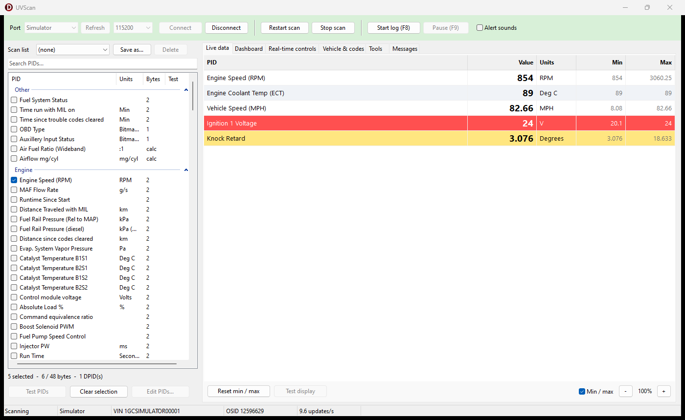

| Area | What it is |
|---|---|
| Top bar | Port, baud, **Connect / Disconnect**, **Start / Stop scan**, **Start log (F8)**, **Pause (F9)**, **Alert sounds** (mutes every alert sound). The bar turns green while scanning and brighter green while logging. |
| Left | The PID list: tick what you want to scan. Above it the **Scan list** row, below it how many bytes the selection needs (the PCM streams at most 48) and **Test PIDs / Clear selection / Edit PIDs…**. |
| Right | Tabs: **Live data**, **Dashboard**, **Real‑time controls**, **Vehicle & codes**, **Tools**, **Messages**. A coloured notice line appears above them when something needs your attention (click it to dismiss). |
| Status bar | Connection state, port, VIN, OS ID, update rate, logging status. |

## Connecting

1. Plug the AVT into the PC and the vehicle (key on).
2. Pick its COM port (**Refresh** re‑reads the list) and the baud rate (115200 for the AVT‑841). Choose **Simulator** to try UVScan without hardware.
3. Press **Connect**. UVScan initialises the AVT, reads its firmware version, the VIN and the PCM operating system ID (shown in the status bar and on *Vehicle & codes*).

Everything that talks to the AVT runs on a background thread, so the window stays responsive while the PCM is busy.

## Choosing PIDs and scan lists

Tick PIDs in the list on the left (type in **Search PIDs…** to filter). The footer shows how many are ticked and how many of the PCM's 48 streaming bytes they use; it turns red when there are too many.

- **Test PIDs** asks the PCM about each ticked PID (or all of them) and shows *yes / no* in the *Test* column.
- **Scan list** holds named selections such as *Misfires* or *Transmission*. Pick one to tick its PIDs, **Save as…** to store the current ticks under a name, **Delete** to remove a list. Lists only remember which PIDs, so fixing a PID's formula fixes it in every list.
- Right‑click a PID → **Display & alerts…** or **Add to dashboard…**.

## Live data

Press **Start scan**. Each ticked PID gets a row with its current value, units and the lowest / highest value seen (**Reset min / max** starts those again).

- **Min / max** in the footer hides or shows those two columns.
- **‑ / +** zoom the grid from 75 % to 250 % — text, rows and columns together. Ctrl + mouse wheel over the grid, Ctrl + plus / minus and Ctrl + 0 (back to 100 %) do the same. Click the percentage to reset.
- Rows take the colours of their [alert levels](#display-and-alerts) and flash when a level says so.
- With up to 4 DPIDs (about 24 bytes of PIDs) the PCM sends about 10 updates a second, with more about 5 (see [protocol notes](protocol.md)).

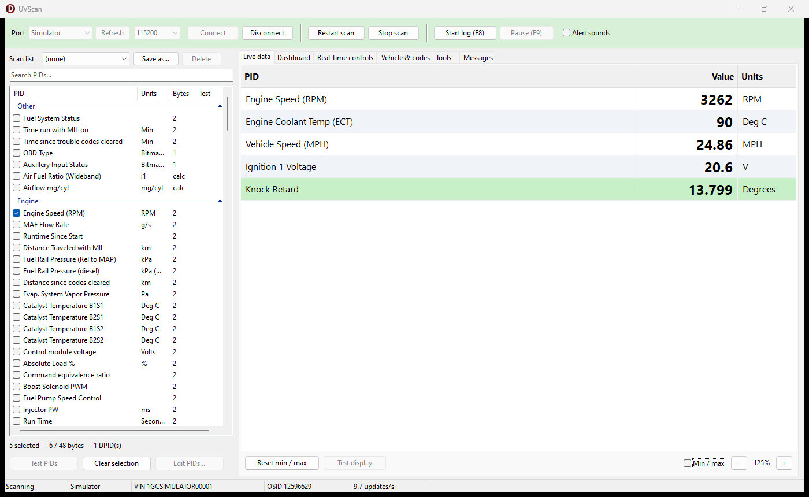

## Display and alerts

Right‑click a PID in the list or a row in the live grid → **Display & alerts…**.

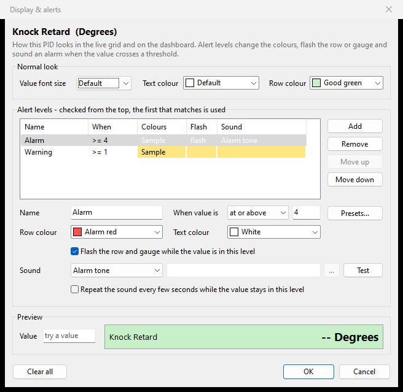

**Normal look** — the size of the value text and the row's text and background colour (for example a pale green row for knock retard, so it stands out).

**Alert levels** — checked from the top; the first one that matches the current value is used. Each level has:

| Setting | Meaning |
|---|---|
| Name | Shown in the grid preview, on the gauge and in Messages (*Alarm*, *Hot*, …). |
| When value is | *at or above, above, at or below, below, equal to, not equal to* a number. |
| Row colour / text colour | The colours while the level is active (*Default* keeps the normal look). |
| Flash | The row and the gauge blink while the level is active. |
| Sound | *Beep* or *Alarm tone* (built into UVScan, so they work even with Windows sounds off), the *Windows alert sound*, or any `.wav` file. **Test** plays it. |
| Repeat | Play the sound again every few seconds while the value stays in the level. |

A sound plays when a PID **enters** a level, at most once every 3 seconds per PID, so a value hovering on a threshold does not machine‑gun. Each alert is also written to Messages. **Alert sounds** in the top bar mutes all of them.

**Presets…** builds green / yellow / red from two numbers: *high values are bad* (knock retard, temperatures) or *low values are bad* (voltage, oil pressure). The red level flashes and sounds the alarm tone.

Type a number in **Preview** to see how the row looks at that value.

Built‑in examples (created the first time UVScan runs, matched to your PIDs by PID code): knock retard (warning ≥ 1°, alarm ≥ 4°), coolant temperature (hot ≥ 104 °C, overheating ≥ 110 °C with a repeating alarm) and ignition voltage (overcharging ≥ 15.5 V, low ≤ 11.5 V, not charging ≤ 12.6 V).

## Dashboard

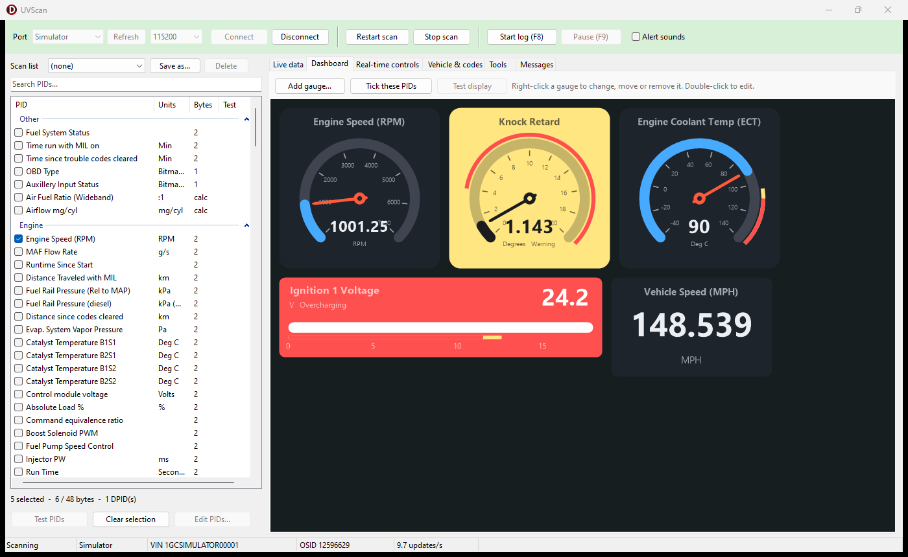

Big gauges for the PIDs you care about most:

- **Dial** — 270° scale with needle and the value in the middle,
- **Bar** — a horizontal bar with the value on the right,
- **Big number** — just the value, large.

Each comes in small, medium or large and has its own scale. Gauges wrap to fit the window.

They follow the **same alert levels** as the grid: the scale shows the levels as coloured bands, the value arc takes the colour of the band it is in (or the PID's normal colour), and while a level is active the whole card takes the level's colours, flashes and sounds.

- **Add gauge…** or right‑click a PID → **Add to dashboard…**
- Right‑click a gauge → **Edit gauge…**, **Display & alerts…**, **Move earlier / later**, **Remove from dashboard**. Double‑click edits.
- **Tick these PIDs** ticks the dashboard's PIDs in the PID list, ready to scan.

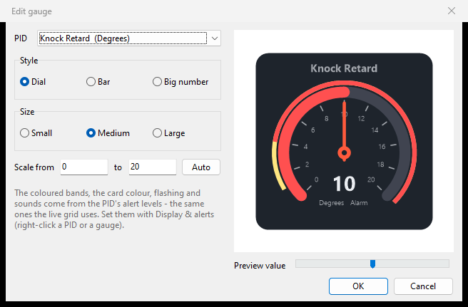

In the gauge editor, **Auto** suggests a scale from the PID's formula (and widens it to show every alert level); drag **Preview value** to see the gauge at any value, including flashing levels.

## Test display

**Test display** (on the *Live data* and *Dashboard* tabs, whenever you are not scanning) fills the grid and the gauges with made‑up values that slowly rise and fall through each PID's range — its gauge scale, widened so every alert threshold is crossed. Use it to check colours, flashing, sounds and gauge layouts without a car. A notice says the values are made up; nothing is sent to the PCM and nothing is logged. Press **Stop test** (or start a real scan) to end it.

## Logging

While scanning, **Start log (F8)** writes every update to a CSV file named `UVScan_<date>_<time>.csv` in the log folder (default *Documents\UVScan Logs*, change it on the *Tools* tab). **Pause (F9)** stops writing rows without closing the file. The first column is the time since the log started, then one column per PID with its units in the header.

## Log viewer

**Log viewer** in the top bar (or **F7**) opens your logs as a chart and a grid that follow one cursor. The first time it opens the newest log in the log folder; **Open log…** picks any file and the list next to it holds the 40 most recent. **Demo drive (made up)** opens a generated 10‑minute drive (cold start, city, highway, a hard pull with knock retard) to try everything without a log.

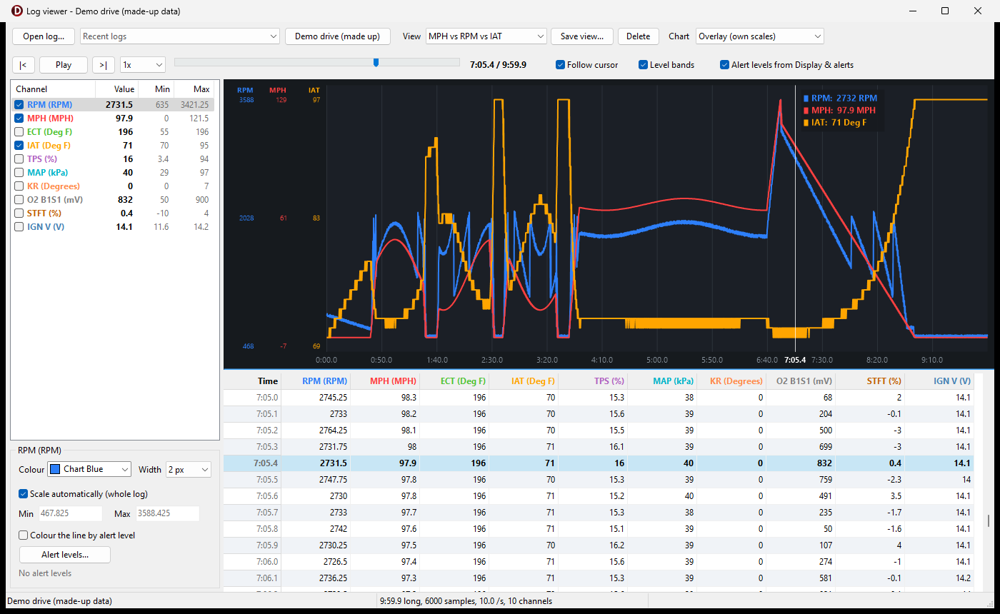

**Channels** (left): tick the ones to chart. *Value* is the value at the cursor, coloured by its alert level; *Min* / *Max* are for the whole log. Select a channel to change it:

| Setting | What it does |
|---|---|
| Colour, width | The line. |
| Scale automatically | Fits the whole log; untick it and type a min and max to fix the scale (e.g. 0‑10° for knock retard so small blips stay small). |
| Colour the line by alert level | Where an alert level matches, the line takes the level's colour and gets thicker. |
| Alert levels… | Levels for this channel in this view, with the same dialog as *Display & alerts*. Without its own levels a channel uses the *Display & alerts* levels of the PID with the same name and units (switch that off with **Alert levels from Display & alerts**). |

**Chart modes** (*Chart* list):

- **Lanes** — a strip per channel, each on its own scale: the clearest way to line up, say, RPM, TPS, MAP and knock retard.
- **Overlay (own scales)** — all lines in one area, each on its own scale with its own coloured axis: good for comparing shapes, e.g. **MPH vs RPM vs IAT**.
- **Overlay (one scale)** — everything on one scale, for channels in the same units.

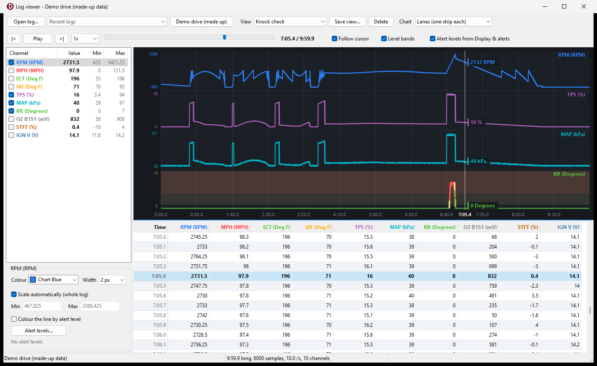

**Moving around:** click or drag in the chart to move the cursor (the grid jumps to that row); the mouse wheel zooms around the mouse; drag with the right mouse button to pan; double‑click to see the whole log. With the chart focused, ←/→ step one sample (Shift: 10), Home / End jump to the ends. Clicking a grid row moves the cursor there too. **Level bands** shades each channel's alert levels behind its line.

**Playback:** **Play** (or Space) runs the cursor through the log in real time — or at 0.25× to 20× — with the chart following (**Follow cursor**), the grid scrolling along and the values on the left updating, like watching the drive again. **|<** and **>|** jump to the start and end; the slider scrubs.

**Views:** **Save view…** stores the ticked channels, colours, widths, scales, alert levels and chart mode under a name; pick it in **View** to apply it to any log (channels are matched by name; ones the view does not list are hidden). The last view used is remembered. Two come with UVScan: *MPH vs RPM vs IAT* and *Knock check*. Views live in `logviews.json`.

## Vehicle and trouble codes

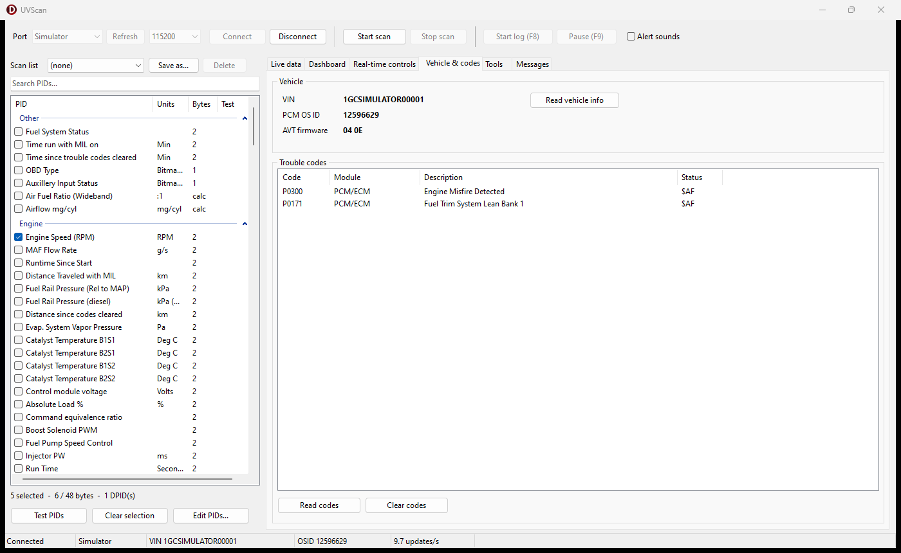

- **Read vehicle info** — AVT firmware, VIN and PCM OS ID.
- **Read codes** — trouble codes from every module that answers (PCM, TCM, ABS, BCM, …) with descriptions from `dtcs.json`.
- **Clear codes** — asks first, then clears the PCM's codes (cycle the key and read again to confirm).

## Real‑time controls

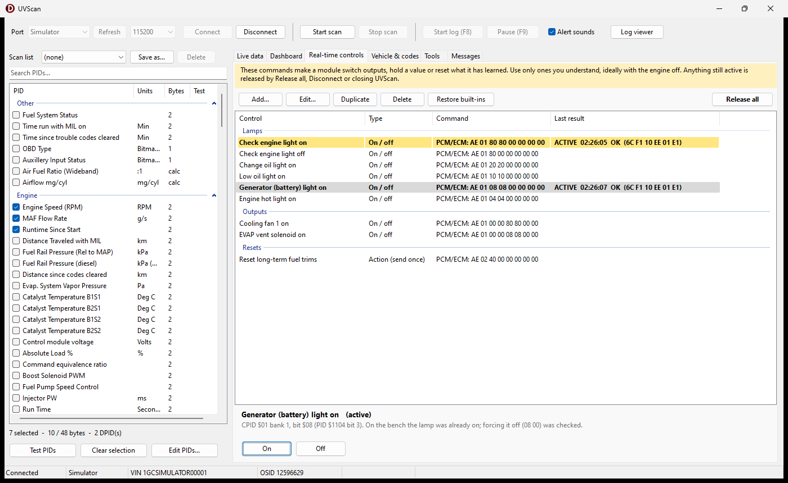

Real‑time controls (also called output tests, device control or special functions) make a module switch an output, hold a value or reset something it has learned — for example turn on the check engine light or reset the learned fuel trims. On GM Class 2 these are **mode $AE device control** requests.

**Every control here sends a command that changes what the PCM does.** Use only ones you understand, ideally with the engine off. Anything still active is released by **Release all**, by **Disconnect** and when UVScan closes; GM modules also drop device control by themselves a few seconds after the scan tool goes quiet.

Each control is one of four types:

| Type | Buttons | What happens |
|---|---|---|
| Action (send once) | **Send** | One command, e.g. a reset. |
| On / off | **On**, **Off** | *On* starts the control and keeps it active (UVScan keeps the session alive) until *Off* or *Release all*. |
| Hold to run | **Hold to run** | On while you hold the button down, off as soon as you let go. |
| Value | slider, **Apply**, **Release** | Sends the chosen value, e.g. an idle speed; *Release* gives control back to the PCM. |

The *Last result* column shows the module's answer — *OK*, or *refused* with the reason (for example *conditions not correct (engine running?)* or *request out of range*). Active controls are highlighted.

Controls work while scanning, so you can watch the PIDs they affect at the same time.

### Built‑in controls

| Control | Type | Command |
|---|---|---|
| Check engine light on / off | on / off | `AE 01 80 80 …` / `AE 01 80 00 …` |
| Change oil, low oil, generator, engine hot light on | on / off | `AE 01 20 20 …`, `10 10`, `08 08`, `04 04` |
| Cooling fan 1 on | on / off (asks first) | `AE 01 00 00 80 80 00 00` |
| EVAP vent solenoid on | on / off | `AE 01 00 00 08 08 00 00` |
| Reset long‑term fuel trims | action (asks first) | `AE 02 40 00 00 00 00 00` |
| Release all (return to normal) | action | `20` |

They were found and checked on a bench PCM (2001 3.8L, OS 9389759) by switching each output and watching the PCM's own status PIDs follow — see [protocol notes](protocol.md#device-control-mode-ae). Other PCMs may use other bits; if one is refused or does nothing on your vehicle, it does not apply there. **Restore built‑ins** puts back any you deleted, and new built‑ins from a newer UVScan are added once by themselves.

Several controls can be on at once: outputs that share a GM control packet (all the lamps, the fan and the EVAP vent are in CPID $01) are combined, so switching one off leaves the others on.

### Adding your own

If you know the command for something (from a service manual, a forum, or by logging what another scan tool sends), press **Add…**:

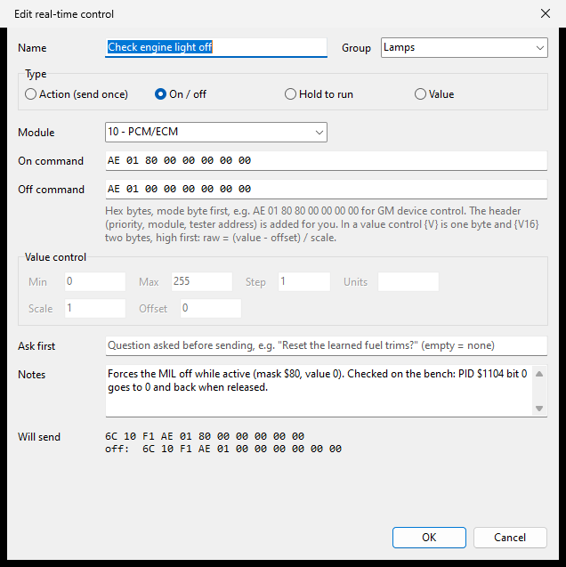

| Field | Meaning |
|---|---|
| Name, Group | How it is listed. |
| Type | Action, on / off, hold to run or value (see above). |
| Module | The module's bus address, e.g. `10` PCM, `18` TCM, `40` BCM. |
| On command / Command | Hex bytes starting with the mode byte, e.g. `AE 01 80 80 00 00 00 00`. The message header (priority, module, tester address) is added for you. |
| Off command / Release | What turns it off again (required for on / off and hold to run). |
| Value control | Min, max and step of the slider, units, and how the value becomes a byte: `{V}` (one byte) or `{V16}` (two bytes, high first) in the command is replaced by `raw = (value − offset) / scale`. |
| Ask first | A question to confirm before sending (leave empty for none). |
| Notes | Shown under the buttons. |

**Will send** shows the exact bytes, and the dialog explains what is wrong until the control is complete. Controls are saved in `controls.json`.

## Tools

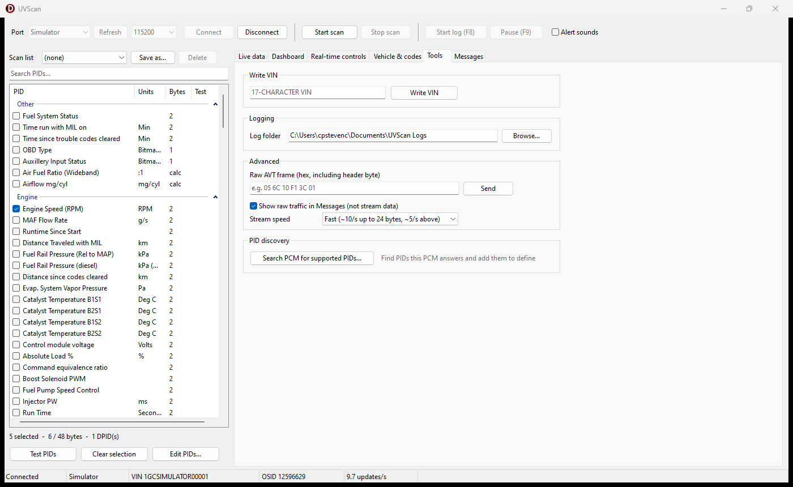

- **Write VIN** — writes a new 17‑character VIN to the PCM (asks first; turn the key off for 15 s afterwards).
- **Logging** — the folder for CSV logs.
- **Advanced** — send a raw AVT frame (hex) and see the reply in Messages, show the raw bus traffic in Messages (**Show raw traffic in Messages**), and choose the stream speed (fast / medium / slow; applies from the next scan).
- **Search PCM for supported PIDs…** — see [below](#finding-pids-a-pcm-supports).

## Editing PIDs

**Edit PIDs…** (under the PID list; not while scanning) opens the PID editor.

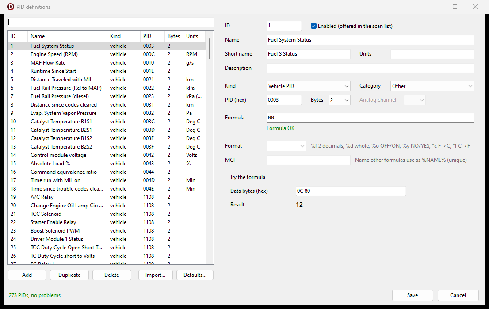

Every PID has a name, short name, category, kind and formula:

| Kind | Needs | Formula inputs |
|---|---|---|
| Vehicle | the PID number (`000C`, `11A6`, …) and its size in bytes | `N0`/`N1` = data byte 1, `N2` = byte 2, … |
| Calculated | — | other PIDs by their MCI name, e.g. `%RPM%`, plus `RUNTIME`, `LOGTIME` |
| Analog | AVT analog channel 1–3 | `N0` = the reading |

Formulas use `+ - * /`, `<< >>`, `& |`, comparisons and `? :` (e.g. `N0 > 127 ? N0 - 256 : N0`). The **Try the formula** box evaluates it with bytes or values you type. The problems panel lists everything that would stop the file loading; click one to jump to it. **Save** refuses to write while there are problems; **Cancel** throws everything away.

- **Import…** reads an old UVSCAN `PIDS.csv` and either adds only new PIDs, adds new and updates matching ones, or replaces the whole list.
- **Defaults…** adds the factory PIDs you are missing, or puts the factory list back completely.

## Finding PIDs a PCM supports

**Tools → Search PCM for supported PIDs…** (connected, not scanning) asks the PCM about every PID in the chosen ranges — standard SAE `$0000‑$00FF` (about 10 s), GM enhanced `$1000‑$1FFF` (about 2 minutes) and any extra ranges — using the read‑only mode `$22`.

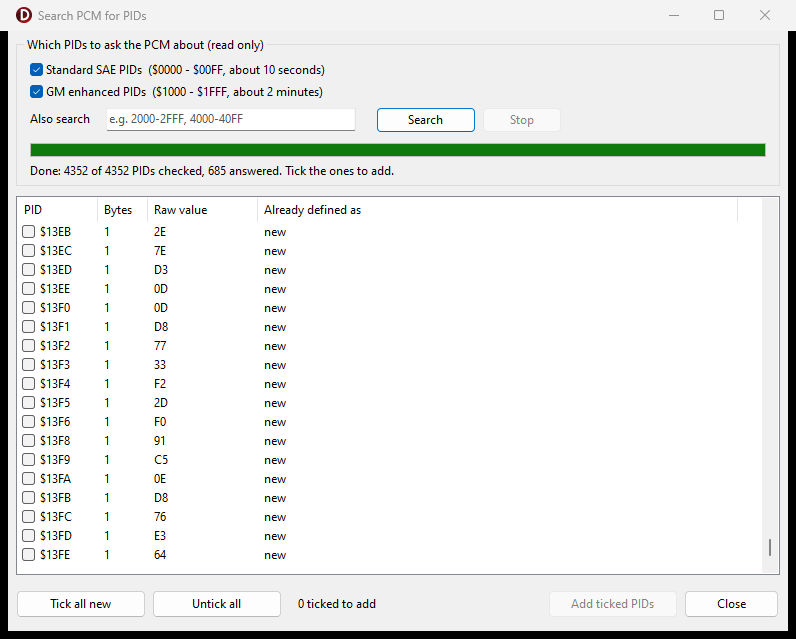

Each PID that answers is listed with its size, raw value and what it is already defined as. Tick the new ones and **Add ticked PIDs**: they are added as `PID $xxxx` (category *Other*) and the PID editor opens filtered to them so you can name them and give them a formula — for example after logging them with the engine running to see what they follow.

## Messages

Everything UVScan does is written here with a timestamp: connection steps, PCM answers and refusals, alerts, real‑time control results and, with **Show raw traffic in Messages** on (*Tools*), every frame sent and received.

## Keyboard and command line

| Key | Action |
|---|---|
| F7 | Log viewer |
| F8 | Start / stop log |
| F9 | Pause / resume log |
| Ctrl + / Ctrl ‑ / Ctrl 0 | Zoom the live grid (Live data tab) |
| Ctrl + mouse wheel | Zoom the live grid |
| Space (log viewer) | Play / pause |
| ← → Home End (log viewer chart) | Step through the log |

```
UVScan.exe -port COM9 -connect -scan -log
```

`-port` picks the port, `-connect` connects at start, `-scan` starts scanning the saved selection, `-log` starts a log as well.

## Where things are stored

Everything UVScan reads or writes, apart from CSV logs, is in **`C:\ProgramData\UVScan`**: `pids.json`, `lists.json`, `display.json`, `controls.json`, `logviews.json`, `dtcs.json` and `settings.json`. Missing files are created from the defaults built into `UVScan.exe`. See [data files](data-files.md) for the formats.

## Troubleshooting

| Problem | Try |
|---|---|
| *Could not open COM…* | Another program (or another UVScan) has the port. Close it, check the port in Device Manager. |
| Connect works but no data | Key on? The status bar's update rate stays at 0 and a notice says *No data from the PCM*. Check the AVT's vehicle connection. |
| *Selected PIDs need N bytes; the limit is 48* | Untick some PIDs; the PCM cannot stream more than 48 bytes. |
| A PID shows *rejected* | The PCM refused it in a DPID. Use **Test PIDs**, or remove it. |
| A real‑time control is *refused* | The reason is in *Last result*. *Request out of range* means this PCM does not have that control; *conditions not correct* usually means the engine is running or the vehicle is moving. |
| No alert sounds | **Alert sounds** in the top bar must be ticked; check the level's sound with **Test**. |
